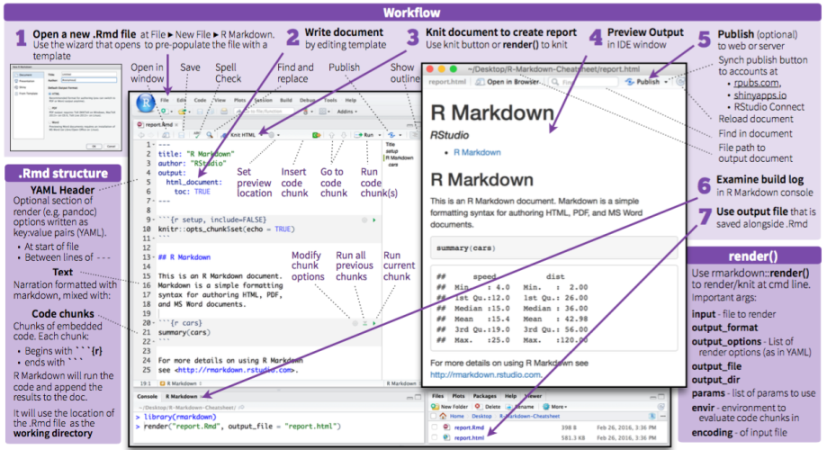
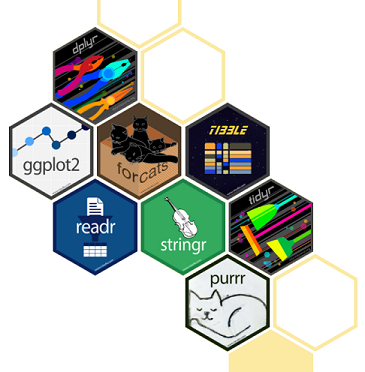
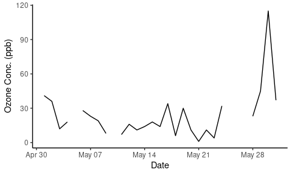

## Learning Objectives

You will learn:

* What literate programming is and why it's important 
* How to use R Markdown for literate programming
* What the "tidyverse" is
* What data "wrangling" is
* Packages and functions used to tidy and wrangle data in R
* How to tidy and wrangle data with R

## Reproducibility 

For the purpose of this discussion, let's define:

* **_Replicate_**: to repeat a study (with new samples and data)
* **_Reproduce_**: to regenerate the results of an analysis (with the same data)

Our studies may be difficult to fully *replicate* ... but our analysis should always be *reproducible*.

Or in other words:

We should always be able to go from raw data to final results at any time ...
*and always get the same results* from the same data and the same analysis*.

`*` Even if you are doing modeling with randomly-generated values, you can set
the *seed* to produce the same values each time you run the analysis. There are
situations where you may encounter small rounding differences, however.

## Literate Programming

In the light of reproducibility, Literate Programming is:

Interspersing explanatory text with code to make a report that is executable 
and improves reproducibility. 

It allows a recipient to re-render the report to review the code/analysis and 
verify the results (including plots and figures).

## Literate Programming Tools

There are two main platforms for literate programming:

* **_Python_** and other languages: Jupyter Notebook (a future topic!)
* **_R_**: R Markdown with *knitr* (today's focus) and [R Notebooks](https://blog.rstudio.com/2016/10/05/r-notebooks)

Both platforms can be used with other programming languages or a mix of them.

## R Markdown and *knitr*

To use R Markdown and *knitr* for Literate Programming, all you need is a text
editor, R, and a few packages such as *knitr*. These tools are well integrated into 
RStudio.

* R Markdown: The text notation you use for formatting, based on Markdown
* *knitr*: A package by Yihui Xie used to render R Markdown documents

](images/storms-004.png)

## Installing R Markdown and *knitr*

You need the R packages *htmltools*, *rmarkdown* and *knitr*.

The first time to try to "knit" in RStudio, you will likely be prompted to 
install these packages. If so, go ahead and install them as prompted.

Otherwise, you can install them manually:


```r
install.packages(c("htmltools", "rmarkdown", "knitr"), dependencies = TRUE)
```

## R Markdown Syntax

[R Markdown](https://rmarkdown.rstudio.com/) is a "wiki" syntax based on 
[Markdown](https://daringfireball.net/projects/markdown/). Here is an 
example:


## R Markdown Cheat Sheet

[R Markdown cheat sheet](https://www.rstudio.com/wp-content/uploads/2016/03/rmarkdown-cheatsheet-2.0.pdf)

 

## *knitr*

The R package which renders the R Markdown document is *knitr*. It uses other 
packages and utilities as needed to produce different document formats.

In RStudio, you would normally run *knitr* using the *Knit* button. 

If your document has been configured in R Markdown to generate a PDF document,
pressing the *Knit* button will create a `.pdf` file.

If you click the little black arrow button next to the *Knit* button, you can
select alternative output options.

You can also use the *File* -> *Knit Document* or *File* -> *Compile Notebook*
menu options.

## Creating an `.Rmd` file

Let's make our first `.Rmd` file. This is similar to making a script:

      File -> New File -> R Markdown...


Be sure to save it! The filename "onramp_example.Rmd" will work for now.

## Features of the Markdown Document 

* YAML Header
* Text
* Code chunks


## Introduction to the Tidyverse

Before we get into data wrangling, let's look at the [Tidyverse](https://www.tidyverse.org/)

<div class="columns-2">



- "The tidyverse is an opinionated collection of R packages designed for data science." 
- "All packages share an underlying design philosophy, grammar, and data structures."
- There are tidyverse packages for data wrangling, modeling, and visualization.

</div>

## Data wrangling with *dplyr*

"[*dplyr*](https://dplyr.tidyverse.org/) is a grammar of data manipulation, 
providing a consistent set of verbs that help you solve the most common data 
manipulation challenges"

Common functions include:
 
* Choosing variables based on their name with `select()` 
* Choosing rows based on a condition with `filter()`
* Grouping data by a variable with `group_by()`
* Creating new variables or changing old variables with `mutate()`

## Loading packages with *pacman*
 
* *pacman* will load packages and automatically install missing packages 
* *pacman* is not a tidyverse package, but it works well with the tidyverse
 

```r
# Load pacman, installing if needed
if (!require("pacman")) 
  install.packages("pacman", repos = "http://cran.r-project.org")

# Load other packages, installing as needed.
pacman::p_load(dplyr, ggplot2)
```

This will load these packages (installing first if neccessary):

- *dplyr* for data wrangling
- *ggplot2* for data visualization

## Example Dataset `airquality`

R has many built-in datasets - let's get an air quality dataset from New York in 1973. 


```r
# Load the "airquality" dataset into the environment.
data(airquality)
```

We can show the structure this dataset with `str()`:


```r
# Show the structure of the dataset
str(airquality)
```

```
## 'data.frame':	153 obs. of  6 variables:
##  $ Ozone  : int  41 36 12 18 NA 28 23 19 8 NA ...
##  $ Solar.R: int  190 118 149 313 NA NA 299 99 19 194 ...
##  $ Wind   : num  7.4 8 12.6 11.5 14.3 14.9 8.6 13.8 20.1 8.6 ...
##  $ Temp   : int  67 72 74 62 56 66 65 59 61 69 ...
##  $ Month  : int  5 5 5 5 5 5 5 5 5 5 ...
##  $ Day    : int  1 2 3 4 5 6 7 8 9 10 ...
```

## Example Dataset `airquality`
 
Alternatively, you can use `class()`, `dim()`, and `head()`:
 

```r
# Show the class and dimensions (153 rows and 6 columns) of the dataset
class(airquality)
```

```
## [1] "data.frame"
```

```r
dim(airquality)
```

```
## [1] 153   6
```

```r
# Display the first three rows of data
head(airquality, n = 3)
```

```
##   Ozone Solar.R Wind Temp Month Day
## 1    41     190  7.4   67     5   1
## 2    36     118  8.0   72     5   2
## 3    12     149 12.6   74     5   3
```

## Wrangle *airquality*

Common data tasks are simplified with dplyr, once you learn the verbs.

Let's add a variable to airquality using `mutate()`


```r
# Add the year of the measurements and look at the first 10 rows
head(mutate(airquality, Year = 1973), n = 10)
```

```
##    Ozone Solar.R Wind Temp Month Day Year
## 1     41     190  7.4   67     5   1 1973
## 2     36     118  8.0   72     5   2 1973
## 3     12     149 12.6   74     5   3 1973
## 4     18     313 11.5   62     5   4 1973
## 5     NA      NA 14.3   56     5   5 1973
## 6     28      NA 14.9   66     5   6 1973
## 7     23     299  8.6   65     5   7 1973
## 8     19      99 13.8   59     5   8 1973
## 9      8      19 20.1   61     5   9 1973
## 10    NA     194  8.6   69     5  10 1973
```

## Wrangle *airquality*

Common data tasks are simplified with *dplyr*, once you learn the verbs.
 
Let's add a variable to `airquality` using `mutate()`
 

```r
# Add the year of the measurements and look at the first 10 rows
head(mutate(airquality, Year = 1973), n = 10)
```

```
##    Ozone Solar.R Wind Temp Month Day Year
## 1     41     190  7.4   67     5   1 1973
## 2     36     118  8.0   72     5   2 1973
## 3     12     149 12.6   74     5   3 1973
## 4     18     313 11.5   62     5   4 1973
## 5     NA      NA 14.3   56     5   5 1973
## 6     28      NA 14.9   66     5   6 1973
## 7     23     299  8.6   65     5   7 1973
## 8     19      99 13.8   59     5   8 1973
## 9      8      19 20.1   61     5   9 1973
## 10    NA     194  8.6   69     5  10 1973
```

## Sneak preview: Using "pipes"
 
Alternatively, we can do the same thing with "pipes", `%>%`:


```r
# Add the year of the measurements and look at the first 10 rows
airquality %>% mutate(Year = 1973) %>% head(n = 10)
```

```
##    Ozone Solar.R Wind Temp Month Day Year
## 1     41     190  7.4   67     5   1 1973
## 2     36     118  8.0   72     5   2 1973
## 3     12     149 12.6   74     5   3 1973
## 4     18     313 11.5   62     5   4 1973
## 5     NA      NA 14.3   56     5   5 1973
## 6     28      NA 14.9   66     5   6 1973
## 7     23     299  8.6   65     5   7 1973
## 8     19      99 13.8   59     5   8 1973
## 9      8      19 20.1   61     5   9 1973
## 10    NA     194  8.6   69     5  10 1973
```
 
Is this code with pipes more readable? Why? We'll see pipes again a little later...

## Wrangle *airquality*
 
Let's take a look at the new `airquality` dataframe with `head()`.
 

```r
# Show the dataframe, looking at the first few rows
head(airquality)
```

```
##   Ozone Solar.R Wind Temp Month Day
## 1    41     190  7.4   67     5   1
## 2    36     118  8.0   72     5   2
## 3    12     149 12.6   74     5   3
## 4    18     313 11.5   62     5   4
## 5    NA      NA 14.3   56     5   5
## 6    28      NA 14.9   66     5   6
```

What happened here? Where did the `Year` column go? 

In our previous step, a dataframe printed to the console (if you entered the command at the promt) or displayed below the code chunck (if you ran the command from the Rmarkdown document) with the new `Year` variable.

We performed a task on the original `airquality` object, but since we did not make a new assignment (e.g., with `<-`), the change was not "saved" to the object in the environment.

## Wrangle *airquality*

Now we'll add `Year` and make a new assignment to save it to memory. 


```r
# Add year to the dataframe
airquality <- mutate(airquality, Year = 1973)

# Take a look!
head(airquality)
```

```
##   Ozone Solar.R Wind Temp Month Day Year
## 1    41     190  7.4   67     5   1 1973
## 2    36     118  8.0   72     5   2 1973
## 3    12     149 12.6   74     5   3 1973
## 4    18     313 11.5   62     5   4 1973
## 5    NA      NA 14.3   56     5   5 1973
## 6    28      NA 14.9   66     5   6 1973
```

Better! 

## Wrangle *airquality*

Now let's create a date column. We'll create a character string first to break the steps down.


```r
# Make a character variable, then a date variable.
airquality <- mutate(airquality, Date_char = paste(Year, Month, Day, sep = "-"))
airquality <- mutate(airquality, Date = as.Date(Date_char, format = "%Y-%m-%d"))

head(airquality)
```

```
##   Ozone Solar.R Wind Temp Month Day Year Date_char       Date
## 1    41     190  7.4   67     5   1 1973  1973-5-1 1973-05-01
## 2    36     118  8.0   72     5   2 1973  1973-5-2 1973-05-02
## 3    12     149 12.6   74     5   3 1973  1973-5-3 1973-05-03
## 4    18     313 11.5   62     5   4 1973  1973-5-4 1973-05-04
## 5    NA      NA 14.3   56     5   5 1973  1973-5-5 1973-05-05
## 6    28      NA 14.9   66     5   6 1973  1973-5-6 1973-05-06
```

```r
# Check the class.
class(airquality$Date)
```

```
## [1] "Date"
```

## Wrangle *airquality*

Say we're only interested in data from May. Let's filter our data now. 

The filter function takes a logical condition, requiring `==` (is equal to?) 
which is different than `=` when we are assigning variables within functions.


```r
airquality <- filter(airquality, Month == 5)
head(airquality)
```

```
##   Ozone Solar.R Wind Temp Month Day Year Date_char       Date
## 1    41     190  7.4   67     5   1 1973  1973-5-1 1973-05-01
## 2    36     118  8.0   72     5   2 1973  1973-5-2 1973-05-02
## 3    12     149 12.6   74     5   3 1973  1973-5-3 1973-05-03
## 4    18     313 11.5   62     5   4 1973  1973-5-4 1973-05-04
## 5    NA      NA 14.3   56     5   5 1973  1973-5-5 1973-05-05
## 6    28      NA 14.9   66     5   6 1973  1973-5-6 1973-05-06
```

```r
dim(airquality)
```

```
## [1] 31  9
```

## Wrangle *airquality*

Next, let's now consider using the pipe operator, `%>%`. It will help us 
streamline these operations to be more clear and succinct. 

The pipe operator feeds the output of one function into the input of the next, avoiding having to make multiple assignments.


```r
# Reload dataset to start fresh.
data(airquality)

# Wrangle airquality with pipe operators starting with original dataframe.
airquality_may <- airquality %>% 
  
  # Add year and date variables using mutate.
  mutate(Year = 1973,
         Date_char = paste(Year, Month, Day, sep = "-"), 
         Date = as.Date(Date_char, format = "%Y-%m-%d")) %>% 
  
  # Filter dataframe to the month of May.
  filter(Month == 5) %>% 
  
  # Select the variables of interest.
  select(Ozone, Temp, Date)
```

## Wrangle *airquality*

Let's take a look.


```r
# Show the dataframe.
head(airquality_may)
```

```
##   Ozone Temp       Date
## 1    41   67 1973-05-01
## 2    36   72 1973-05-02
## 3    12   74 1973-05-03
## 4    18   62 1973-05-04
## 5    NA   56 1973-05-05
## 6    28   66 1973-05-06
```

## Wrangle *airquality*

What if we're interested in the average ozone and temperature by month? Would we have to repeat this process for each month? *dplyr* has easy and powerful functions to perform data wrangling tasks on groups: `group_by()` and `summarise()`


```r
# Average by month, using the argument `na.rm = TRUE` to ignore the NA values.
# If you omit `na.rm = TRUE`, then any NAs will cause the mean to be NA. 
airquality_by_month <- airquality %>% 
  
  # Group dataframe by month.
  group_by(Month) %>% 
  
  # Calculate average ozone concentration and temperature.
  summarise(Ozone_avg = mean(Ozone, na.rm = TRUE), 
            Temp_avg = mean(Temp, na.rm = TRUE),
            .groups = "keep")
```

The last argument, `.groups` specifies how to leave the grouping when the 
operation is finished. In this case, we "keep" the grouping as it is. (This is 
an "experimental" feature as of *dplyr* 1.0.2.)

## Wrangle *airquality*


```r
# Show new dataframe.
airquality_by_month
```

```
## # A tibble: 5 x 3
##   Month Ozone_avg Temp_avg
##   <int>     <dbl>    <dbl>
## 1     5      23.6     65.5
## 2     6      29.4     79.1
## 3     7      59.1     83.9
## 4     8      60.0     84.0
## 5     9      31.4     76.9
```


## Make a plot using *ggplot2*

Now let's make a simple plot so we have an example for our rendered document. The goal here is just to introduce the main plotting tool of the Tidyverse - we'll be covering *ggplot2* in more detail in the future.


```r
# Create a ggplot object and save it as "p".
p <- ggplot(data = airquality_may) + 
  
  # Specify the type of geometry and the aesthetic features.
  geom_line(aes(x = Date, y = Ozone)) + 
  
  # Specify the labels.
  labs(y = "Ozone Conc. (ppb)") + 
  
  # Choose the theme.
  theme_classic()
```

## Make a plot using *ggplot2*


```r
# Show the plot.
print(p)
```

<!-- -->

## Render Markdown Document

Next, let's render the document using the "Knit" button.

## 


<pre style="color: indigo; background: linear-gradient(to right, gold, rgba(255,0,0,0)); padding-top: 50px; padding-bottom: 50px;">
                                                                                        
                                                  ,,                                    
  .g8""8q.                                 mm     db                           ,M"""b.  
.dP'    `YM.                               MM                                  89'  `Mg 
dM'      `MM `7MM  `7MM  .gP"Ya  ,pP"Ybd mmMMmm `7MM  ,pW"Wq.`7MMpMMMb.  ,pP"Ybd    ,M9 
MM        MM   MM    MM ,M'   Yb 8I   `"   MM     MM 6W'   `Wb MM    MM  8I   `" mMMY'  
MM.      ,MP   MM    MM 8M"""""" `YMMMa.   MM     MM 8M     M8 MM    MM  `YMMMa. MM     
`Mb.    ,dP'   MM    MM YM.    , L.   I8   MM     MM YA.   ,A9 MM    MM  L.   I8 ,,     
  `"bmmd"'     `Mbod"YML.`Mbmmd' M9mmmP'   `Mbmo.JMML.`Ybmd9'.JMML  JMML.M9mmmP' db     
      MMb                                                                               
       `bood'
</pre>
<!-- http://patorjk.com/software/taag/#p=display&f=Georgia11&t=Questions%3F%0A -->


